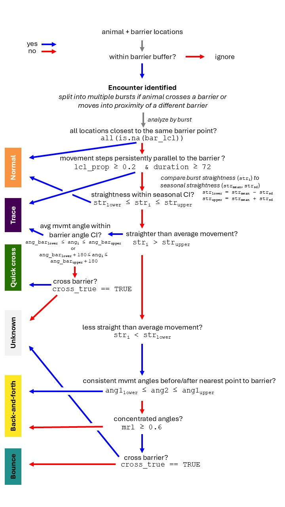

# Barrier Behavior Analysis
## Description
The Barrier Behavior Analysis (BaBA) is a spatially and temporally explicit method to identify and classify barrier behaviors based on GPS tracking data and linear spatial features. Barrier behaviors can be used to examine permeability of barriers for animal movement.

The BaBA was originally developed by Xu et al. (2021) for use with fences and has been heavily modified here for use with road interactions by caribou of the Western Arctic Herd in northwestern Alaska (Fullman et al. 2025). The original approach can be run using the argument caribou = FALSE in the BaBA function. Use caribou = TRUE to run our modified version.

Our modified BaBA classifies 5 movement behaviors: normal, quick cross, back-and-forth, bounce, and trace. See the following examples of each:

To install the latest development version of our modified BaBA, open an R session and run: 
**devtools::install_github('tfullman/BaBA')**

## BaBA Workflow

## Relevant publications: 
Fullman TJ, Joly K, Gustine DD, Cameron MD. 2025. Behavioral responses of migratory caribou to semi-permeable roads in arctic Alaska. Scientific Reports 15, 24712. https://doi.org/10.1038/s41598-025-10216-6

Xu W, Dejid N, Herrmann V, Sawyer H, Middleton AD. 2021. Barrier Behaviour Analysis (BaBA) reveals extensive effects of fencing on wide-ranging ungulates. Journal of Applied Ecology 58, 690-698. https://doi.org/10.1111/1365-2664.13806

